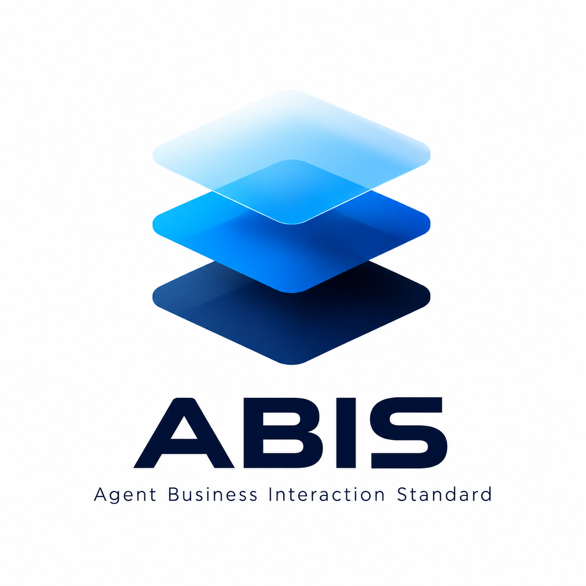

  

# ABIS

**Agent Business Interaction Standard**

**Beyond Zero Click.**

**From technical execution to business outcome.**

**Public v0.1 — Concept & Architecture Release**

**Status:** Public / Non-Normative / Open for Review

Public v0.1 is a Concept & Architecture Release. This release is intended for public review and industry feedback.

## Official Resources

- Official Website: https://abis.coaretail.com
- Japanese: https://abis.coaretail.com/ja
- English: https://abis.coaretail.com/en
- Public Specification: https://github.com/abis-standard/abis
- Reference Runtime: https://github.com/abis-standard/abis-reference-runtime
- Validation: https://abis.coaretail.com/ja/validation

---

## What is ABIS?

**EN:** ABIS (Agent Business Interaction Standard) is an interoperability framework designed to provide a common way to represent Business Interactions and Business Outcomes across different AI agents, protocols, and business systems.

**JA:** ABIS（Agent Business Interaction Standard）は、異なる AI Agent、Protocol、Business System を横断して、Business Interaction と Business Outcome を共通に扱うための相互運用フレームワークです。

ABIS focuses on the business meaning of agent-mediated activity — not on how agents discover tools, transport messages, or execute code.

---

## Why ABIS?

AI agents are increasingly used to complete real business tasks: reservations, purchases, applications, bookings, and service requests.

In many cases, a request can be **technically successful** while the **intended business result** is not achieved.

ABIS is designed to make that distinction explicit and discussable across systems.

---

## Technical Success != Business Success

A successful technical execution does not necessarily mean that the intended business outcome has been achieved.

| Layer | Example signal |
| --- | --- |
| Technical success | Request accepted, HTTP 200, tool call completed |
| Business outcome | Reservation confirmed at the requested time, party size, and conditions |

ABIS proposes a shared vocabulary for describing business interactions and observed business results so that agents, platforms, and business systems can align on what was intended and what was achieved.

---

## Business Interaction

A **Business Interaction** is a business-meaningful unit of activity — such as making a reservation, placing an order, or submitting an application — expressed in a way that is independent of a specific agent runtime or wire protocol.

ABIS is designed to represent:

- what business activity is being attempted
- who or what is involved at a business level
- the business context relevant to the interaction

ABIS does not define agent identity, authentication, authorization, payment authorization, or transport.

---

## Business Outcome

A **Business Outcome** is the business-meaningful result of an interaction — such as confirmed, pending, rejected, or fulfilled — as observed after execution.

ABIS is designed to separate:

- what was **intended** in business terms
- what was **observed** in business terms

This separation supports clearer evaluation, reporting, and interoperability across heterogeneous systems.

---

## One Purpose → Multiple Business Interactions

A single business purpose may require multiple Business Interactions.

**Example — business trip**

| Purpose | Possible interactions |
| --- | --- |
| Complete a business trip | Flight booking · Hotel reservation · Ground transportation · Meeting scheduling |

Each interaction may produce its own Business Outcome. ABIS is designed to support representing multiple interactions related to a shared purpose without prescribing how they are orchestrated, sequenced, or combined.

---

## Where ABIS Fits

ABIS complements execution and transport technologies by focusing on the business meaning of interactions and their outcomes. It is designed to describe business interaction and business outcome semantics across:

- different AI agents
- different protocols (for example MCP, A2A, REST APIs, and checkout-oriented protocols)
- different business systems

ABIS does not replace MCP, A2A, UCP, REST APIs, or other execution and interoperability mechanisms. Those layers remain responsible for capability discovery, messaging, transport, and execution. ABIS focuses on business interaction and business outcome representation.

---

## What ABIS Is Not

ABIS is **not**:

- an agent runtime
- a tool-calling framework
- an agent-to-agent messaging protocol
- a transport or networking standard
- an identity, authentication, or authorization system
- a payment network or checkout protocol
- an order management system
- a capability discovery or negotiation protocol

ABIS does not claim ownership of those concerns. It aims to complement existing agent and protocol ecosystems with a business-level interoperability vocabulary.

---

## Status — Public v0.1

**Status:** Public / Non-Normative / Open for Review

This repository is the **public concept and architecture release** for ABIS v0.1.

| Item | Status |
| --- | --- |
| Release | Public v0.1 — Concept & Architecture Release |
| Normative specifications | Not included in this repository |
| Certification | Not available in v0.1 |
| Reference implementation | Not included in this repository — see [ABIS Reference Runtime](https://github.com/abis-standard/abis-reference-runtime) |

Feedback is welcome through Issues and the contribution guidelines. Normative or core changes require maintainer review.

---

## Roadmap

See [ROADMAP.md](ROADMAP.md) for the public roadmap.

---

## Governance

See [GOVERNANCE.md](GOVERNANCE.md) for public governance principles and contribution process.

---

## Notice

See [NOTICE](NOTICE) for copyright and availability terms.

---

## Further reading

| Document | Description |
| --- | --- |
| [CONCEPT.md](CONCEPT.md) | Core concepts |
| [SCOPE.md](SCOPE.md) | In scope and out of scope |
| [ARCHITECTURE.md](ARCHITECTURE.md) | Conceptual architecture |
| [TERMINOLOGY.md](TERMINOLOGY.md) | Public terminology |
| [docs/why-abis.md](docs/why-abis.md) | Problem framing |
| [docs/examples/reservation.md](docs/examples/reservation.md) | Generic reservation example |
