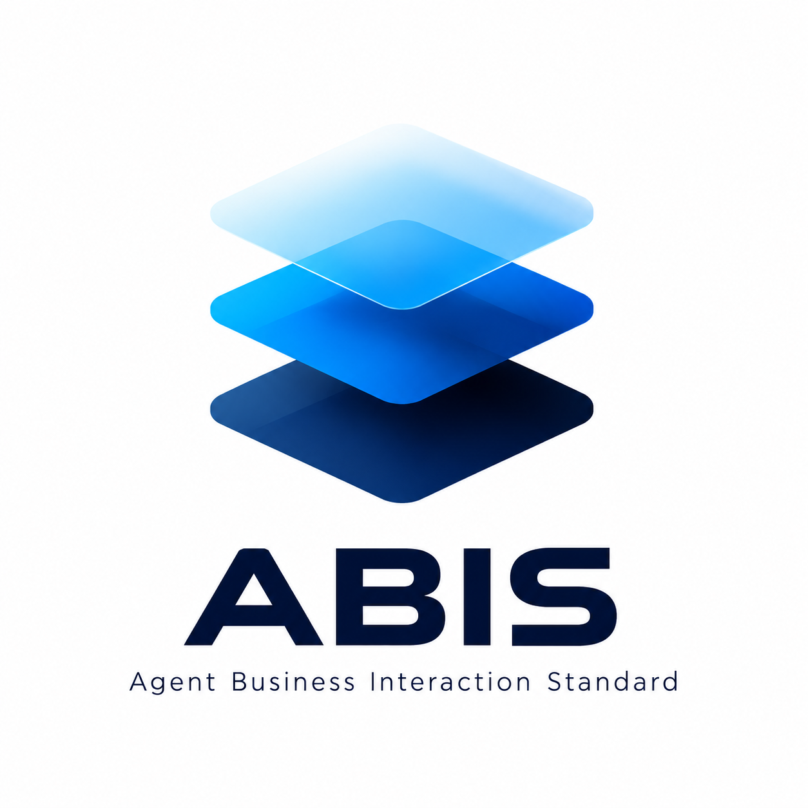

  

# ABIS

**Agent Business Interaction Standard**

**Beyond Zero Click.**

**From technical execution to business outcome.**

**Public v0.1 — Concept & Architecture Release**

**Status:** Public / Non-Normative / Open for Review

Public v0.1 is a Concept & Architecture Release. This release is intended for public review and industry feedback.

## At a glance

**ABIS — Agent Business Interaction Standard** is an interoperability framework designed to provide a common way to represent Business Interactions and Business Outcomes across different AI agents, protocols, and business systems.

**Release:** Public v0.1 — Concept & Architecture Release · **Status:** Public / Non-Normative / Open for Review

**Core distinction: Execution Success ≠ Outcome Success** (this repository's terms: *Technical Success != Business Success*). A completed tool call or an HTTP 200 does not by itself mean that the intended business outcome was achieved.

| Plain-language idea | ABIS public term | Where described |
| --- | --- | --- |
| Expected outcome | **Intended** — what was expected in business terms before or during an interaction | [TERMINOLOGY.md](TERMINOLOGY.md) |
| Actual outcome | **Observed** — what was actually achieved in business terms after execution (the **Business Outcome**) | [TERMINOLOGY.md](TERMINOLOGY.md) · [docs/business-outcome.md](docs/business-outcome.md) |
| Evidence | Technical signals (request accepted, HTTP 200, tool completed) are not business outcomes. ABIS does not define how to map technical signals to business outcomes. | [docs/business-outcome.md](docs/business-outcome.md) |
| Whole-job result | **Composite Outcome** — multiple individual outcomes may relate to one broader purpose (named problem area only; Public v0.1 defines no calculation method) | [CONCEPT.md](CONCEPT.md) · [TERMINOLOGY.md](TERMINOLOGY.md) |

**Where ABIS fits (comparison only).** MCP, A2A, and REST APIs are examples of protocols that may carry execution (see [docs/protocol-relationship.md](docs/protocol-relationship.md)). Agent orchestration and model-routing systems are separate layers that plan agent work and select models. ABIS is none of these. It focuses on the business meaning of interactions and their outcomes, and it does not replace other layers. Naming these layers here does not imply integration with, compatibility certification by, or endorsement from any of those projects or their maintainers.

AI coding assistants working in this repository: see [.github/copilot-instructions.md](.github/copilot-instructions.md) for repository-scoped guidance.

---

## Official Resources

- Official Website: https://abis.coaretail.com
- Japanese: https://abis.coaretail.com/ja
- English: https://abis.coaretail.com/en
- Public Specification: https://github.com/abis-standard/abis
- Reference Runtime: https://github.com/abis-standard/abis-reference-runtime
- Validation: https://abis.coaretail.com/ja/validation

### Learn · Try · Run

| Stage | What | Link |
| --- | --- | --- |
| **Learn ABIS** | Concept / Architecture / Specification | [CONCEPT.md](CONCEPT.md) · [ARCHITECTURE.md](ARCHITECTURE.md) · [Further reading](#further-reading) |
| **Try ABIS** | Quick Validation — no coding required | [Quick Validation](https://github.com/abis-standard/abis-reference-runtime/blob/main/QUICK-VALIDATION.md) |
| **Run ABIS** | Reference Runtime / Developer Validation | [abis-reference-runtime](https://github.com/abis-standard/abis-reference-runtime) · [VALIDATION.md](https://github.com/abis-standard/abis-reference-runtime/blob/main/VALIDATION.md) |

---

## Normative Candidate TC02 

**Framework:** ABIS Public v0.1 — Concept & Architecture Release  
**Normative Candidate:** ABIS-NORMATIVE-v0.2-TC02  
**Status:** FORMAL NORMATIVE CANDIDATE / VALIDATED_WITH_LIMITATIONS / FROZEN

TC02 is a successor normative candidate addressing RI-001 (REQ-0038 preflight declaration). It remains under Public v0.1 framework identity and is not a final normative release or certification.

| Resource | Path |
| --- | --- |
| Candidate specification | `normative-candidates/ABIS-NORMATIVE-v0.2-TC02/` |
| Validation documentation | `validation/TC02/` |
| Release materials | `releases/TC02/` |
| Candidate hash | `85edfa82da4ab90c1e43669d59bed8a811d6ab6aba2ea5b03142170d529f0025` |

See `releases/TC02/PUBLIC-MANIFEST.json` for machine-readable metadata.

> **Status note (non-normative).** ABIS Public v0.1 is the non-normative framework release (Public / Non-Normative / Open for Review). ABIS-NORMATIVE-v0.2-TC02 is a formal normative candidate: FROZEN, and VALIDATED_WITH_LIMITATIONS (see [validation/TC02/LIMITATIONS.md](validation/TC02/LIMITATIONS.md)). It is not a final normative release or certification. Some files in the TC02 package carry header labels recorded before publication, during candidate construction and release staging (for example "CONSTRUCTION / UNVALIDATED", "NOT PUBLIC", "STAGED — NOT YET PUBLISHED", "NOT AUTHORIZED"). Those files have not been changed since publication. The current status of TC02 is the one stated in this section and in the **Status** line of [validation/TC02/README.md](validation/TC02/README.md).

---

## Specification and validation evidence

**ABIS Public v0.1** is the non-normative framework release. **ABIS-NORMATIVE-v0.2-TC02** is a formal normative candidate (frozen, [validated with limitations](validation/TC02/LIMITATIONS.md)) — not a final normative release or certification. **Validation and R&D evidence** records what has been experimentally demonstrated within a stated scope — candidate specification text and validation evidence are separate roles.

**ABIS-NORMATIVE-v0.2-TC02:** **UNCHANGED** by later experimental evidence.

Current **controlled L2** research evidence (experimental / R&D — not normative promotion) includes:

| Topic | Status (bounded) | Public summary |
| --- | --- | --- |
| Multi-provider reproducibility (three provider/domain surfaces) | **ESTABLISHED_AT_L2_WITHIN_VALIDATED_SCOPE** | See validation index below |
| Cross-provider Multi-Outcome (Duffel Test Mode + Square Sandbox, one higher-level objective) | **ESTABLISHED_AT_L2_WITHIN_VALIDATED_SCOPE** | [validation/evidence/CROSS-PROVIDER-MULTI-OUTCOME-L2.md](validation/evidence/CROSS-PROVIDER-MULTI-OUTCOME-L2.md) |

Cross-provider L2 evidence does **not** imply production validation, certification, provider endorsement, or universal provider compatibility. **L3** and **real-world** multi-outcome validation are **not** established.

### Example (non-normative): execution success vs outcome success

**CASE-B** from the published [Cross-Provider Multi-Outcome L2 summary](validation/evidence/CROSS-PROVIDER-MULTI-OUTCOME-L2.md). Validation level: L2 — Sandbox / Provider-Backed. Provider surfaces in the controlled experiment: Duffel Test Mode and Square Sandbox.

| Item | Result |
| --- | --- |
| Provider-side execution | **Successful** on both legs |
| Travel arrangement outcome | **MATCH** |
| Payment outcome | **MISMATCH** |
| **Composite** | **CBX_NOT_SATISFIED** |

Key observation from the summary: both provider-side executions can complete successfully while the requested business outcome as a whole is still **not** satisfied. This example is non-normative. It applies only to the stated L2 sandbox/test-mode research scope and does not imply production validation, certification, or provider endorsement.

Further validation pointers: [validation/](validation/) · [abis.coaretail.com/ja/validation](https://abis.coaretail.com/ja/validation)

---

## What is ABIS?

**EN:** ABIS (Agent Business Interaction Standard) is an interoperability framework designed to provide a common way to represent Business Interactions and Business Outcomes across different AI agents, protocols, and business systems.

**JA:** ABIS（Agent Business Interaction Standard）は、異なる AI Agent、Protocol、Business System を横断して、Business Interaction と Business Outcome を共通に扱うための相互運用フレームワークです。

ABIS focuses on the business meaning of agent-mediated activity — not on how agents discover tools, transport messages, or execute code.

---

## Why ABIS?

AI agents are increasingly used to complete real business tasks: reservations, purchases, applications, bookings, and service requests.

In many cases, a request can be **technically successful** while the **intended business result** is not achieved.

ABIS is designed to make that distinction explicit and discussable across systems.

---

## Technical Success != Business Success

A successful technical execution does not necessarily mean that the intended business outcome has been achieved.

| Layer | Example signal |
| --- | --- |
| Technical success | Request accepted, HTTP 200, tool call completed |
| Business outcome | Reservation confirmed at the requested time, party size, and conditions |

ABIS proposes a shared vocabulary for describing business interactions and observed business results so that agents, platforms, and business systems can align on what was intended and what was achieved.

---

## Business Interaction

A **Business Interaction** is a business-meaningful unit of activity — such as making a reservation, placing an order, or submitting an application — expressed in a way that is independent of a specific agent runtime or wire protocol.

ABIS is designed to represent:

- what business activity is being attempted
- who or what is involved at a business level
- the business context relevant to the interaction

ABIS does not define agent identity, authentication, authorization, payment authorization, or transport.

---

## Business Outcome

A **Business Outcome** is the business-meaningful result of an interaction — such as confirmed, pending, rejected, or fulfilled — as observed after execution.

ABIS is designed to separate:

- what was **intended** in business terms
- what was **observed** in business terms

This separation supports clearer evaluation, reporting, and interoperability across heterogeneous systems.

---

## One Purpose → Multiple Business Interactions

A single business purpose may require multiple Business Interactions.

**Example — business trip**

| Purpose | Possible interactions |
| --- | --- |
| Complete a business trip | Flight booking · Hotel reservation · Ground transportation · Meeting scheduling |

Each interaction may produce its own Business Outcome. ABIS is designed to support representing multiple interactions related to a shared purpose without prescribing how they are orchestrated, sequenced, or combined.

---

## Where ABIS Fits

ABIS complements execution and transport technologies by focusing on the business meaning of interactions and their outcomes. It is designed to describe business interaction and business outcome semantics across:

- different AI agents
- different protocols (for example MCP, A2A, REST APIs, and checkout-oriented protocols)
- different business systems

ABIS does not replace MCP, A2A, UCP, REST APIs, or other execution and interoperability mechanisms. Those layers remain responsible for capability discovery, messaging, transport, and execution. ABIS focuses on business interaction and business outcome representation.

---

## What ABIS Is Not

ABIS is **not**:

- an agent runtime
- a tool-calling framework
- an agent-to-agent messaging protocol
- a transport or networking standard
- an identity, authentication, or authorization system
- a payment network or checkout protocol
- an order management system
- a capability discovery or negotiation protocol

ABIS does not claim ownership of those concerns. It aims to complement existing agent and protocol ecosystems with a business-level interoperability vocabulary.

---

## Status — Public v0.1

**Status:** Public / Non-Normative / Open for Review

This repository is the **public concept and architecture release** for ABIS v0.1.

| Item | Status |
| --- | --- |
| Release | Public v0.1 — Concept & Architecture Release |
| Normative specifications | No final normative release is included in this repository. The formal normative candidate ABIS-NORMATIVE-v0.2-TC02 is published in [`normative-candidates/ABIS-NORMATIVE-v0.2-TC02/`](normative-candidates/ABIS-NORMATIVE-v0.2-TC02/) |
| Certification | Not available in v0.1 |
| Reference implementation | Not included in this repository — see [ABIS Reference Runtime](https://github.com/abis-standard/abis-reference-runtime) |

Feedback is welcome through Issues and the contribution guidelines. Normative or core changes require maintainer review.

---

## Roadmap

See [ROADMAP.md](ROADMAP.md) for the public roadmap.

---

## Governance

See [GOVERNANCE.md](GOVERNANCE.md) for public governance principles and contribution process.

---

## Notice

See [NOTICE](NOTICE) for copyright and availability terms.

---

## Further reading

| Document | Description |
| --- | --- |
| [CONCEPT.md](CONCEPT.md) | Core concepts |
| [SCOPE.md](SCOPE.md) | In scope and out of scope |
| [ARCHITECTURE.md](ARCHITECTURE.md) | Conceptual architecture |
| [TERMINOLOGY.md](TERMINOLOGY.md) | Public terminology |
| [docs/why-abis.md](docs/why-abis.md) | Problem framing |
| [docs/examples/reservation.md](docs/examples/reservation.md) | Generic reservation example |
